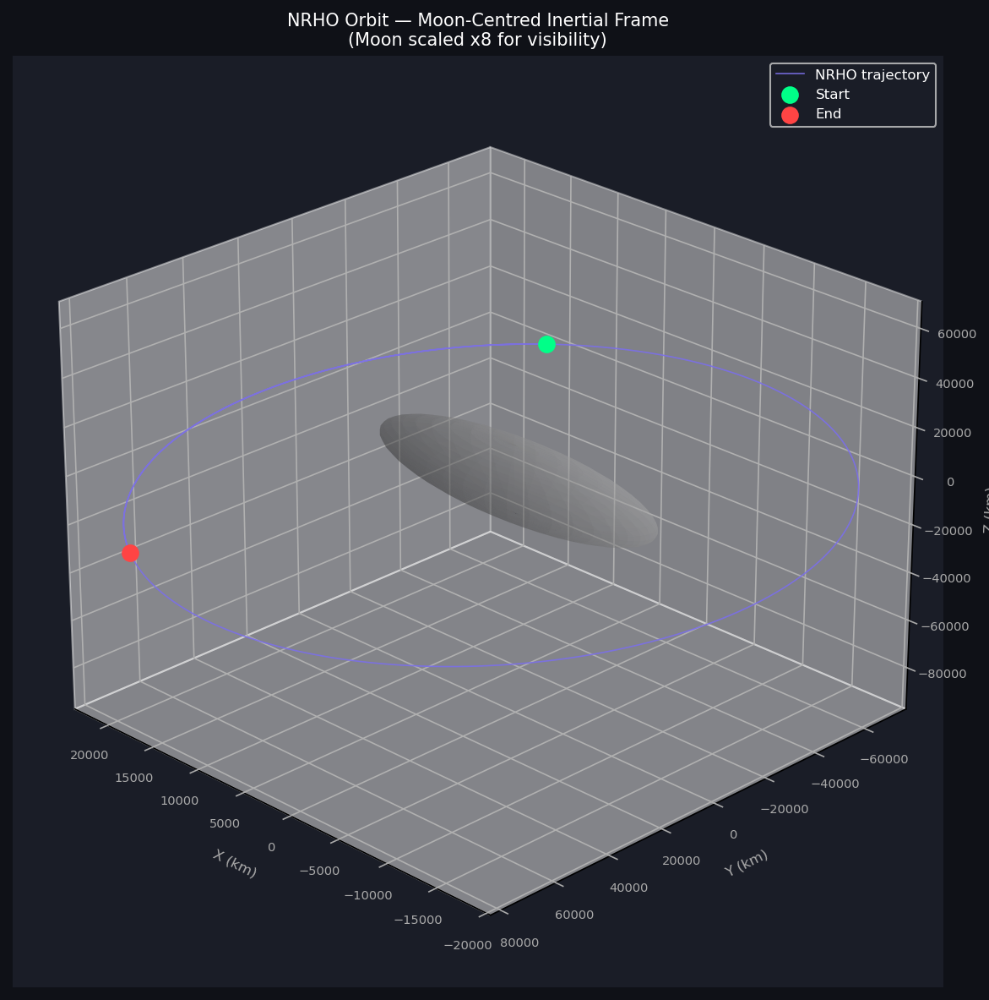
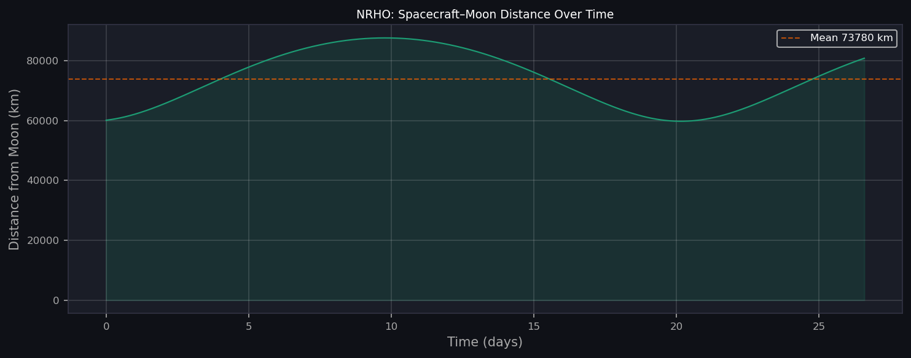
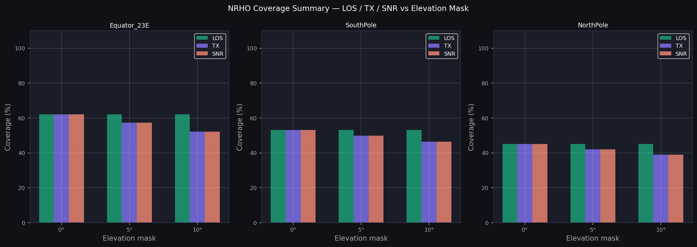
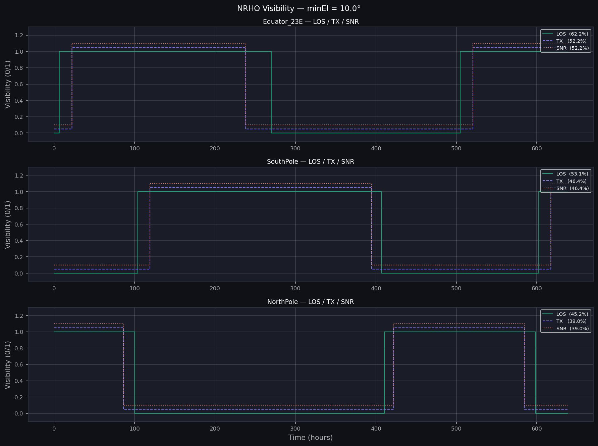

# NRHO Visibility Analysis Tool

Python tool for cis-lunar Near Rectilinear Halo Orbit (NRHO) visibility 
and coverage analysis of lunar surface sites.

Developed as part of MEng thesis research at UNSW Sydney (2025), supervised 
by Prof. Andrew Dempster and Dr. Yang Yang (co-authors of the 
[HALO propagation framework](https://arxiv.org/abs/2403.xxxxx)).

This tool is a Python port of a MATLAB/HALO pipeline used to analyse 
communication coverage between an NRHO relay spacecraft and three lunar 
surface sites, supporting Artemis-era mission planning.

---

## Results

### NRHO Trajectory — Moon-Centred Inertial Frame

### Spacecraft–Moon Distance Over Time

### Coverage Summary — LOS / TX / SNR vs Elevation Mask

### Visibility Time Series — minEl = 10°

---

## Coverage Results

| Site | Mask | LOS | TX | SNR |
|---|---|---|---|---|
| Equator 23°E | 0° | 62.2% | 62.2% | 62.2% |
| Equator 23°E | 5° | 62.2% | 57.3% | 57.3% |
| Equator 23°E | 10° | 62.2% | 52.2% | 52.2% |
| South Pole | 0° | 53.1% | 53.1% | 53.1% |
| South Pole | 5° | 53.1% | 49.8% | 49.8% |
| South Pole | 10° | 53.1% | 46.4% | 46.4% |
| North Pole | 0° | 45.2% | 45.2% | 45.2% |
| North Pole | 5° | 45.2% | 42.0% | 42.0% |
| North Pole | 10° | 45.2% | 39.0% | 39.0% |

---

## Project Structure